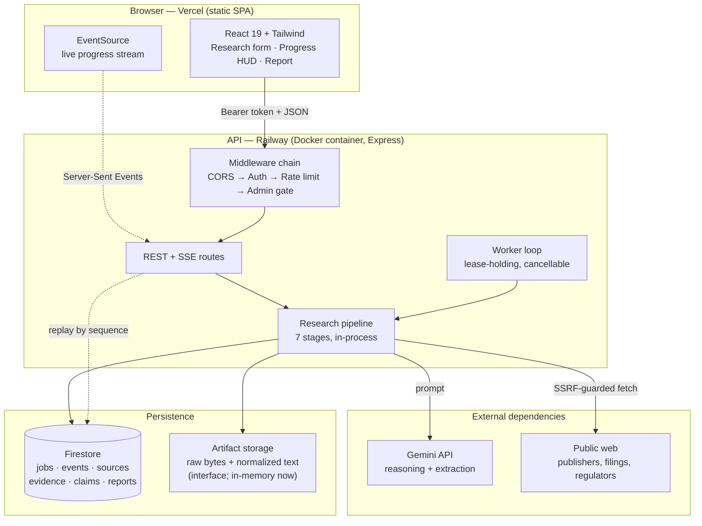
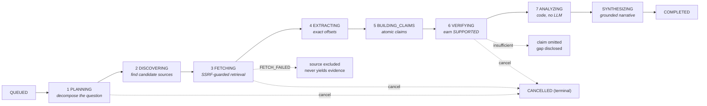
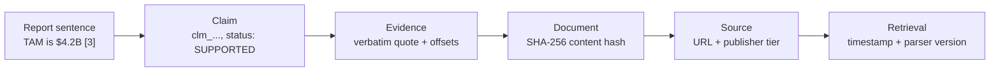
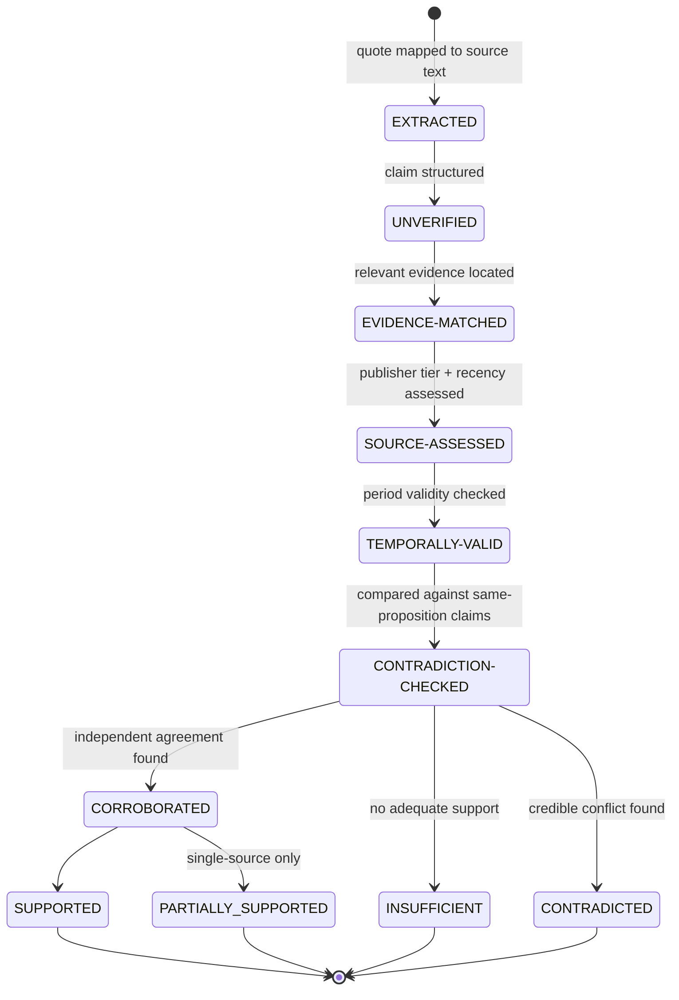
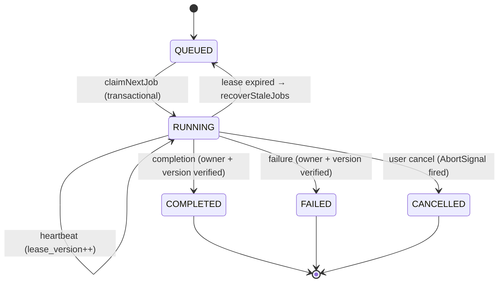
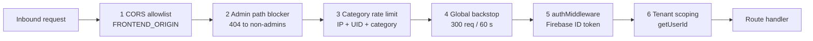
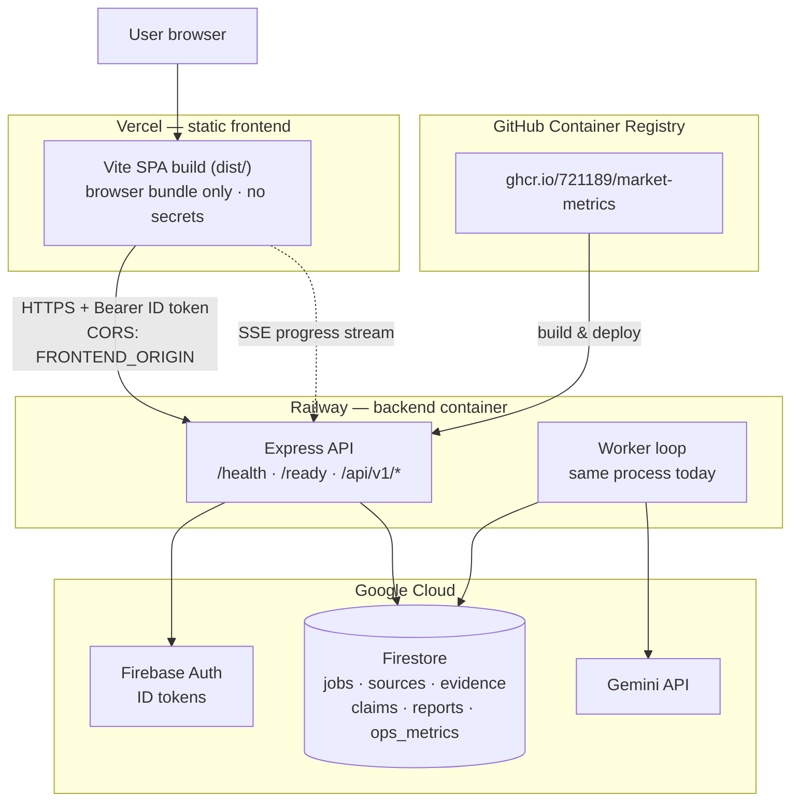
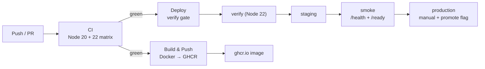

# Market Intelligence V2 — Autonomous Market Research & Evidence Engine

<div align="center">

**An evidence-first research engine where the LLM may reason over evidence, but never becomes the evidence.**

[](https://github.com/721189/Market-Metrics/actions/workflows/ci.yml)
[](https://github.com/721189/Market-Metrics/actions/workflows/build-push.yml)
[](https://github.com/721189/Market-Metrics/actions/workflows/deploy.yml)

`TypeScript` · `React 19` · `Express` · `Firestore` · `Gemini` · `Docker` · `Railway + Vercel`

</div>

---

## Table of Contents

| | Section |
|---|---|
| 1 | [The Problem & The Invariant](#1-the-problem--the-invariant) |
| 2 | [System Architecture](#2-system-architecture) |
| 3 | [The Research Pipeline](#3-the-research-pipeline) |
| 4 | [Evidence Provenance: Does This Number Exist?](#4-evidence-provenance-does-this-number-exist) |
| 5 | [Claim Verification Lifecycle](#5-claim-verification-lifecycle) |
| 6 | [Queue Correctness & Lease Semantics](#6-queue-correctness--lease-semantics) |
| 7 | [Live Events & SSE](#7-live-events--sse) |
| 8 | [Deterministic Financial Engine](#8-deterministic-financial-engine) |
| 9 | [Hardening Register (P0 / P1)](#9-hardening-register-p0--p1) |
| 10 | [Security Model](#10-security-model) |
| 11 | [Cost Governance](#11-cost-governance) |
| 12 | [Observability](#12-observability) |
| 13 | [Deployment Topology](#13-deployment-topology) |
| 14 | [CI/CD Pipeline](#14-cicd-pipeline) |
| 15 | [Configuration Reference](#15-configuration-reference) |
| 16 | [API Reference](#16-api-reference) |
| 17 | [Testing & Benchmark Corpus](#17-testing--benchmark-corpus) |
| 18 | [Local Development](#18-local-development) |
| 19 | [Honest Boundaries](#19-honest-boundaries) |
| 20 | [License](#20-license) |
| 21 | [Contributing](#21-contributing) |
| 22 | [Code of Conduct](#22-code-of-conduct) |

---

## 1. The Problem & The Invariant

Generative models are fluent, not truthful. Asked for a market size, a raw LLM will produce a
confident number with no provenance. Decision-makers then act on a fabrication.

This engine inverts the relationship between model and evidence:

> **Invariant 1 — The LLM may reason over evidence, but it must never become the evidence.**
>
> **Invariant 2 — LLMs explain. Code calculates.**

Concretely:

| Concern | Owner | Why |
|---|---|---|
| Finding sources, extracting facts, phrasing | **LLM** | Language work — models are genuinely good at this |
| Arithmetic (CAGR, TAM/SAM/SOM, LTV, payback) | **Code** | Models make arithmetic errors; calculators do not |
| Deciding what is *supported* | **Code** | Assertions must be earned against evidence, not asserted |
| Deciding what is *citable* | **Code** | A citation graph is validated before any report is persisted |

Nothing reaches a reader without a citation that resolves to an exact character range in a
fetched document. When evidence is insufficient, the correct output is **nothing** — the engine
omits the claim and records the gap rather than inventing a placeholder.

---

## 2. System Architecture



**Design commitments visible in this diagram**

- The browser **never** talks to Gemini, Firestore, or the open web. All privileged work is
  server-side.
- The pipeline is **in-process** with the API (no separate broker today). It is written so a
  worker role can be split out later without changing the pipeline itself.
- Firestore holds the **structured research graph**; bulk document bytes belong in object
  storage behind `ArtifactStorage`, not in Firestore.

---

## 3. The Research Pipeline



| # | Stage | What happens | Executor | Failure semantics |
|---|---|---|---|---|
| 1 | `PLANNING` | Question decomposed into orthogonal search axes | LLM | Retryable, then job `FAILED` |
| 2 | `DISCOVERING` | Candidate sources collected and tiered by authority | LLM + code | Invalid URLs **skipped honestly**; unknown metadata stays `null` |
| 3 | `FETCHING` | Documents retrieved through the hardened network boundary | Code | Per-source `FETCH_FAILED` with the real reason. **Zero fetchable sources ⇒ job fails honestly** — no evidence base, no report |
| 4 | `EXTRACTING` | Verbatim quotes located at exact character offsets, hashed | LLM proposes, **code verifies** | Quote that will not map to real source text is discarded |
| 5 | `BUILDING_CLAIMS` | Quotes become atomic, typed claims with provenance links | LLM + code | Claims start at `UNVERIFIED` — never pre-granted |
| 6 | `VERIFYING` | Claims earn status against evidence; contradictions sought | Code | Failing claims become `INSUFFICIENT` / `CONTRADICTED`, not silently downgraded |
| 7 | `ANALYZING` | CAGR, TAM/SAM/SOM, unit economics, sensitivities | **Code only** | Deterministic; identical inputs ⇒ identical outputs |
| — | `SYNTHESIZING` | Narrative grounded strictly in the verified claim registry | LLM | Ungrounded entities are **dropped and counted** in `limitations` |

**Why the ordering matters.** Analysis runs on *verified* claims, and synthesis runs on the
*validated* claim graph. Fabrication cannot propagate forward because each stage only consumes
what the previous stage proved.

---

## 4. Evidence Provenance: Does This Number Exist?

Every number in a report answers one question deterministically:

> *Where exactly did this come from?*



The provenance record stored with each evidence item:

| Field | Purpose |
|---|---|
| `document_hash` | Detects any drift between what was cited and what was read |
| `source_url` | Resolvable origin |
| `retrieved_at` | Temporal anchor — freshness is auditable |
| `parser_version` / `normalizer_version` | Reproducibility across parser changes |
| `start_offset` / `end_offset` | Exact character range |
| `quote` | The verbatim slice at those offsets |

**Exact normalized → original mapping.** Source text is projected into a canonical normalized
space (Unicode punctuation folding, whitespace collapse, case folding) alongside an
index map back to the original. A match found in normalized space is translated back to
original coordinates, and the stored quote is `sourceText.slice(start, end)` — the **verbatim
source slice**, never the model's re-typed variant. If the mapping is not exact, the match is
rejected rather than approximated.

**Failed fetches are first-class.** Every source carries
`fetch_status: NOT_FETCHED | FETCHED | FETCH_FAILED` plus `fetch_error`. A failed fetch is
recorded with its real reason, excluded from the text corpus, and can therefore never produce
evidence. It appears in the appendix and exports as `FETCH_FAILED` — visible, not hidden.

---

## 5. Claim Verification Lifecycle

A claim does not start out true. It **earns** `SUPPORTED`, and every earlier rung is recorded so
a reviewer can see how far a claim actually got.



| Status | Meaning | Usable in report |
|---|---|---|
| `EXTRACTED` | Quote located in source text | No |
| `UNVERIFIED` | Structured, not yet assessed | No |
| `EVIDENCE-MATCHED` | Relevant evidence found | No |
| `SOURCE-ASSESSED` | Publisher tier and recency evaluated | No |
| `TEMPORALLY-VALID` | Period is appropriate for the question | No |
| `CONTRADICTION-CHECKED` | Compared against same-proposition claims | No |
| `CORROBORATED` | Independent sources agree above threshold | Yes |
| `SUPPORTED` | Fully earned | Yes |
| `PARTIALLY_SUPPORTED` | Real but single-source | Yes, labelled |
| `CONTRADICTED` | Credible sources conflict | Yes, disclosed as a dispute |
| `INSUFFICIENT` | Not enough evidence | No — surfaced as a gap |

**Contradiction detection compares propositions, not numbers.** Two claims are only compared
when their comparison key matches:

```
(entity, metric, geography, period, population, unit, methodology, source_context)
```

A missing key component makes the pair **non-comparable** (conservative: no contradiction is
invented). This prevents the classic false positives — `TAM` vs `SAM`, `2024` vs `2025`,
`India` vs `global` — from being reported as disagreements. Numeric divergence is only
evaluated *within* a matched key.

---

## 6. Queue Correctness & Lease Semantics

Work is claimed from Firestore inside transactions. Ownership is proven, not assumed.



| Mechanism | Rule |
|---|---|
| `worker_id` | Identifies the lease holder |
| `lease_id` | Unique per acquisition — proves *this* claim, not a previous one |
| `lease_version` | Monotonic counter; incremented on every heartbeat |
| Heartbeat | Transactional; extends **only** if `status === RUNNING && worker_id === workerId` |
| Completion / failure | Transactional; verifies both ownership *and* the state machine |
| `recoverStaleJobs` | Re-reads and re-verifies at recovery time — it never blind-assigns from a stale snapshot |
| **Lost lease** | The worker aborts at its next checkpoint and stops. It does **not** write results — the new owner owns them |

**Cancellation is a real state machine, not a flag.** `CANCELLED` is terminal: the transition
table refuses to resurrect a cancelled job. Cancelling fires an `AbortController`, which
propagates into in-flight fetches and model calls, so a cancel stops work rather than merely
labelling it. A job cancelled by the user keeps `USER_CANCEL` as its reason even if the
pipeline later unwinds — completion cannot overwrite it.

---

## 7. Live Events & SSE

Event identity and event ordering are separate concerns, deliberately:

| Field | Type | Purpose |
|---|---|---|
| `id` | `string` (UUIDv7, time-ordered) | Identity — safe to use as a path/key, never coerced to a number |
| `sequence` | `number` (monotonic per job) | Ordering, replay, and SSE resume |
| `created_at_ms` | `number` | Timestamp |

Ordering and resume use `sequence` (`afterSequence`), so a reconnecting browser replays exactly
the events it missed. The stream sets `Cache-Control: no-cache, no-transform` and
`X-Accel-Buffering: no` so no proxy buffers progress away, and keeps a heartbeat so idle
connections are not reaped. Authentication is by Bearer token; a token supplied in the query
string is explicitly rejected.

---

## 8. Deterministic Financial Engine

No model touches the arithmetic. This is the "LLMs explain, code calculates" invariant in
practice — a fabricated CAGR is not a style problem, it is a correctness failure.

| Calculation | Formula |
|---|---|
| CAGR | $\left(\frac{\text{End}}{\text{Start}}\right)^{1/n} - 1$ |
| TAM (top-down) | `market_size × segment_share` |
| TAM (bottom-up) | `unit_price × addressable_units` |
| SAM / SOM | TAM narrowed by serviceable and obtainable fractions |
| LTV | $\frac{\text{ARPU} \times \text{Gross Margin \%}}{\text{Annual Logo Churn \%}}$ |
| CAC Payback (months) | $\frac{\text{CAC}}{\frac{\text{ARPU} \times \text{Gross Margin \%}}{12}}$ |
| Sensitivity | LTV:CAC and break-even re-evaluated across a churn × ARPU grid |
| Forecast bands | $P_{10}$ / $P_{50}$ / $P_{90}$ **deterministic scenario bands** |

> **Note on the $P_{10}$/$P_{50}$/$P_{90}$ bands:** these are deterministic sensitivity
> scenarios, not a stochastic simulation. The earlier "Monte Carlo" label was inaccurate and has
> been removed — the numbers are reproducible from the inputs, which is what makes them auditable.

Financial periods come from the actually-extracted financial years in the evidence, not from
hardcoded years.

---

## 9. Hardening Register (P0 / P1)

The engineering work is tracked as an explicit, auditable register. These are the guarantees the
codebase currently makes.

### P0 — Correctness and integrity

| # | Guarantee | Mechanism |
|---|---|---|
| 1 | Real cancellation state machine | Explicit transition table; `CANCELLED` terminal; `AbortController` propagation |
| 2 | Lease ownership verification | Transactional heartbeat/completion proving `worker_id` + `lease_id` + `lease_version` |
| 3 | Workers stop on lease loss | Definitive ownership loss aborts the worker at its next checkpoint; no result writes |
| 4 | No fabricated source metadata | Domain from parsed hostname; unknown title/publisher/hash/HTTP status stay `null` |
| 5 | Unknown publication date = `null` | No "now" fallback; recency scoring excludes unknown dates instead of granting credit |
| 6 | No hardcoded claim references | Section citations derived from the verified claim set; ungrounded entities dropped |
| 7 | Synthesis grounded in the claim graph | Synthesizer receives the verified registry; every entity must carry valid claim IDs |
| 8 | Citation graph validation is mandatory | Validation runs **before** persistence; a dangling reference aborts the save |
| 9 | Failed fetches explicit | `fetch_status = FETCH_FAILED` + `fetch_error`; excluded from the corpus |
| 10 | Truthful source statistics | `discovered` / `fetched` / `fetch_failed` / `analyzed` counted separately |
| 11 | Exact normalized → original mapping | Stored quote is the verbatim source slice at exact offsets, or the match is rejected |
| 12 | No synthetic synthesis behaviour | "Realistic industry standards" fallback removed; empty is a valid answer |

### P1 — Production hardening

| # | Guarantee | Mechanism |
|---|---|---|
| 13 | Retry taxonomy | `RETRYABLE` (429, transient network, provider outage, contention) vs `NON_RETRYABLE`; exponential backoff + jitter |
| 14 | Persistent identity-based rate limits | Key = `IP + Firebase UID + category` via `RateLimitStore` (fail-open) |
| 15 | Cost governor | Per-request, per-user-daily, global-daily budgets; caps on sources, document size, model calls, retries |
| 16 | Raw artifact persistence | `ArtifactStorage` boundary holds raw bytes + normalized text + metadata + hash + parser version |
| 17 | Idempotent submissions | Persistent Firestore record keyed by idempotency key + user + request fingerprint |
| 18 | Administrative endpoint lockdown | `/system/*`, `/admin/*`, `/metrics`, `/errors`, `/backup`, `/restore` server-side gated |
| 19 | Environment isolation | development / staging / production with a guard forbidding staging from binding production |
| 20 | Deterministic benchmark corpus | Frozen corpus with expected sources, quotes, offsets, values, contradictions, statuses |
| 21 | Fault-injection concurrency suite | Duplicate claims, duplicate completions, lease expiry, crash, cancel mid-fetch, cancel mid-model-call |
| 22 | Observability | Structured JSON logs, spans, in-process metrics, alert evaluation, admin-gated `/metrics` |
| 23 | Containerised + reproducible deploys | Multi-stage Docker image, GHCR publishing, staging → smoke → production promotion |

---

## 10. Security Model

Every request passes a fixed chain. Each layer is independent — a bypass of one does not
disable the others.



| # | Layer | Blocks | Failure mode |
|---|---|---|---|
| 1 | CORS | Browser-origin abuse from unlisted origins | Deny |
| 2 | `adminPathBlocker()` | `/system/*`, `/admin/*`, `/metrics`, `/errors`, `/backup`, `/restore` | **Fail closed** — empty `ADMIN_UIDS` means nobody is admin |
| 3 | `rateLimiterByCategory()` | Cost abuse per identity + endpoint class | **Fail open** — a store outage must not take the API down |
| 4 | Global limiter | Coarse flood backstop | Fail open |
| 5 | `authMiddleware` | Unauthenticated and forged tokens | Deny (401) |
| 6 | Tenant scoping | Cross-tenant reads and writes | Deny (404 — existence is not leaked) |

**Admin gating is server-side, and the front end is irrelevant.** `adminPathBlocker` is
installed *before* every route, so `/metrics` is reachable only by an authenticated operator.
Hiding a button in the UI is not an access control.

**Outbound network boundary (`src/server/fetcher.ts`).** The pipeline fetches arbitrary
URLs suggested by a model, so the egress path is treated as hostile input:

| Control | Rule |
|---|---|
| Protocol allowlist | Only `http:` and `https:` — everything else raises `SSRF blocked: Unsupported protocol` |
| Hostname denylist | `localhost`, `*.local`, and private/internal targets raise `SSRF blocked: Access to private or internal IP/hostname ... is forbidden` |
| Redirects | Re-validated, so a public URL cannot bounce to an internal one |
| Document size / timeout | Bounded per fetch, so one response cannot exhaust the process |

A blocked fetch becomes a recorded `FETCH_FAILED` with a real reason — it is not retried, and it
cannot silently become evidence. `ssrf_blocked` is classified `NON_RETRYABLE` in the retry
taxonomy (see `src/server/gemini.ts`).

**Secrets.** Model credentials live only in server-side environment variables; no key is ever
exposed to the client bundle. `GEMINI_CREDENTIAL_SOURCE` records *where* a credential came from
descriptively — it never contains the secret itself.

**Environment isolation.** `APP_ENV` / `NODE_ENV` select `development | staging | production`;
an unset or unknown value resolves to **development, never production**. Staging and production
must supply their own Firebase identifiers and boot fails closed otherwise. When
`PRODUCTION_PROJECT_ID` is set, staging and development are forbidden from binding it — the
structural guarantee that you cannot accidentally test against production data.

---

## 11. Cost Governance

Two accounting layers, because they answer different questions. Request caps bound a single run;
persistent budgets bound an account over time and survive restarts and replicas.

### Layer 1 — Request-scoped caps (in-process, per pipeline run)

| Cap | Default | Protects against |
|---|---|---|
| `maxSources` | 25 | Runaway discovery fan-out |
| `maxDocumentSizeBytes` | 50 MB | One huge document stalling a worker |
| `maxModelCalls` | 120 | Retry storms |
| `maxRetries` | 3 | Infinite retry loops |
| `requestBudgetUsd` | $25 | A single pathological request |

### Layer 2 — Persistent spend (`CostStore`)

| Budget | Default | Scope |
|---|---|---|
| Per-user daily | $10 | UTC day, per account |
| Per-user monthly | $100 | UTC month, per account |
| Global daily | $500 | UTC day, all users — the kill switch |

Keys are date-partitioned (`cost:daily:{uid}:{yyyy-mm-dd}`, `cost:monthly:{uid}:{yyyy-mm}`,
`cost:global:{yyyy-mm-dd}`), so budgets reset naturally and no document accumulates forever.

| `COST_STORE` | Behaviour |
|---|---|
| `memory` | Default. Correct for a single replica |
| `firestore` | Selected but **not yet wired** → fails closed with an explicit error |
| `redis` | Not provisioned → fails closed with an explicit error |

**Refusing to degrade silently is the feature.** A store that cannot actually enforce a budget
crashes loudly at boot instead of quietly under-counting spend. Every denial returns a reason
string, so a blocked call is explained rather than mysterious.

---

## 12. Observability

Three pillars, all in-process and dependency-free, all exposed through the admin-gated
`GET /metrics` endpoint.

| Pillar | Implementation | What it answers |
|---|---|---|
| **Metrics** | `MetricsRegistry` — counters, gauges, histograms | How much, how fast, how expensive |
| **Spans** | `spans.ts` — `startSpan()` / `endSpanWithError()` | Which stage was slow or failed |
| **Logs** | Structured JSON via `logger` (no stray `console.*` in server code, CI-enforced) | What exactly happened, with correlation ids |

**Metrics are deterministic by construction.** Histograms keep bucket counts and derive
`p50` / `p95` / `p99` from them; snapshots are sorted by name then label signature, so two
identical runs produce byte-identical output — which is what lets the benchmark suite compare
engine output rather than merely assert it did not throw. Cardinality is capped by series count,
so a mislabelled caller cannot grow the registry without bound.

### Default alert rules

| Rule | Metric | Condition | Severity |
|---|---|---|---|
| `queue_backlog` | `queue_depth` | > 200 | warning |
| `queue_backlog_critical` | `queue_depth` | > 2000 | **critical** |
| `job_failure_ratio` | `jobs_failed` | > 50 | warning |
| `lease_recovery_storm` | `lease_recoveries` | > 25 | warning |
| `provider_errors` | `provider_errors` | > 10 | **critical** |
| `citation_validation_failures` | `citation_failures` | > 0 | **critical** |
| `job_cost_outlier` | `cost_per_job` | > $5 | warning |

The thresholds encode which failure modes actually matter here: a dead worker pool, a queue
backing up, a provider outage, runaway cost — and, most importantly,
`citation_validation_failures`, which fires at **a single occurrence** because a report that
fails its own citation-graph check is a data-integrity event, not a performance warning.

**Persistence without a hot document.** The registry dies on restart, so a flusher snapshots it
every 60 s into `ops_metrics/{yyyy-mm-dd}/hours/{hh}` using atomic `set(..., { merge: true })`.
Every replica writes the same hourly document, so history survives redeploys with no
cross-replica coordination and no single contended document. Flush failures are **logged, never
thrown** — telemetry must never take down serving — and persistence is skipped entirely when
`NODE_ENV=test` or no Firestore target is configured.

---

## 13. Deployment Topology



| Component | Host | Notes |
|---|---|---|
| Front end | **Vercel** | Static SPA from `npm run build`. Holds **no** credentials — the model key never reaches the bundle |
| API | **Railway** | Docker image; `GET /health` liveness, `GET /ready` readiness (includes queue stats) |
| Database | **Firestore** | Multi-database aware via `FIRESTORE_DATABASE_ID` |
| Identity | **Firebase Auth** | ID tokens verified server-side; add the Vercel domain to *Authorized domains* |
| Model | **Gemini** | Server-side only, never client-side |
| Images | **GHCR** | Tagged per commit (`main`, `main-<sha>`); the verified artifact is what gets promoted |

**Cross-origin by design.** The SPA and the API are separate origins, so the backend must be told
the frontend origin via `FRONTEND_ORIGIN` (comma-separated allowlist). Empty in development
reflects localhost origins; **staging and production must set it explicitly**.

**Single replica today, multi-replica ready.** `RATE_LIMIT_STORE`, `COST_STORE` and `CACHE_STORE`
default to `memory`, which is correct for one replica. The store interfaces exist so that scaling
out means implementing a `Redis*` / `Firestore*` store behind the same interface — **no
middleware or route changes**. `docker-compose.yml` deliberately omits Redis for the same reason:
it is not needed yet, and it will be added when replica count justifies it.

---

## 14. CI/CD Pipeline



| Workflow | File | Trigger | Purpose |
|---|---|---|---|
| **CI** | `ci.yml` | Every push to any branch, PRs to `main`, manual | Typecheck, full test suite, build, dependency guards |
| **Build & Push Docker Image** | `build-push.yml` | Push to `main` touching backend paths (`Dockerfile`, `.dockerignore`, `src/**`, `server.ts`, `package.json`, `package-lock.json`) | Build the Railway image, push to GHCR, smoke-test the container on port 3000 |
| **Deploy** | `deploy.yml` | Push to `main`, manual | `verify` → `staging` → `smoke` → `production` |

### What the CI matrix proves

CI runs on **Node 20.x and 22.x** with `fail-fast: false`. Suppressing fail-fast is deliberate:
when one version fails and cancels the other mid-flight, the evidence needed to distinguish a
version-specific bug from a universal one is destroyed.

| Step | Guarantee |
|---|---|
| `Runtime versions` | The failure is reproducible from the log alone |
| `npm ci` (lockfile-exact) | The lockfile is authoritative; a stale one cannot ship |
| `Verify test toolchain (tsx + esbuild)` | Catches a missing platform binary *explicitly*, instead of a sub-second opaque crash |
| `Typecheck` (`tsc --noEmit`) | No type regressions |
| `npm test` | Firestore emulator harness, queue races and lease recovery, ownership and security rules, API auth and middleware, pipeline fixture, citation integrity, cost/artifact, concurrency and fault injection, deploy layer, benchmark corpus, precision hardening, observability, E2E and load |
| `Diagnostics (on failure)` | Dumps runtime, platform, and `@esbuild` / `@rollup` platform packages so a failure is diagnosable without a re-run |
| `Environment isolation self-check` | Asserts the isolation guard itself works in CI |
| `Build` + `Upload build artifact` | The client and server bundles actually build |

A second job, **Forbidden-architecture guard**, enforces the invariants that are easy to
regress:

| Check | Why |
|---|---|
| No `bullmq`, `ioredis`, `pg`, `drizzle-orm`, `drizzle-kit`, `@types/pg` imports | The PostgreSQL/Drizzle/BullMQ architecture was deliberately removed; it must not creep back |
| Single lockfile policy | Keeps only `package-lock.json` — a stray `bun.lock` silently diverges the dependency graph |
| No stray `console.*` in `src/server` | Server code logs through the structured logger, so production output stays parseable |

### Promotion path

`verify` (Node 22) → `staging` → `smoke` → `production`. Production is reachable **only** via a
manual `workflow_dispatch` with `promote_to_production` enabled, and it re-asserts production
isolation before promoting the exact artifact staging already validated.

Each environment asserts its own isolation before deploying: staging must not bind the production
project, and production must not bind dev or staging. Staging's assertion **warns and stops**
when the environment secrets have not been provisioned yet, rather than reporting a red build
for infrastructure that does not exist; the production gate stays strictly fail-closed.

---

## 15. Configuration Reference

| Variable | Default | Required | Purpose |
|---|---|---|---|
| `APP_ENV` | `development` | — | `development` \| `staging` \| `production`. Unknown values resolve to development, **never** production |
| `NODE_ENV` | — | — | Standard runtime mode (`test` in CI) |
| `GEMINI_API_KEY` | — | Yes (real research) | Model credential. Server-side only |
| `GEMINI_CREDENTIAL_SOURCE` | `""` | — | Descriptive origin of the credential (e.g. `env:GEMINI_API_KEY`). **Never** the secret |
| `FIREBASE_PROJECT_ID` | `""` | staging/prod | Owns the environment's resources. Dev/test fall back to `firebase-applet-config.json` |
| `FIRESTORE_DATABASE_ID` | `""` | staging/prod | Supports multi-database projects |
| `STORAGE_BUCKET` | `""` | staging/prod | Raw retrieval artifacts (raw HTML/PDF + normalized text) |
| `FIREBASE_AUTH_DOMAIN` | `""` | staging/prod | Firebase auth domain |
| `PRODUCTION_PROJECT_ID` | `""` | — | When set, staging/development are **forbidden** from binding it |
| `FRONTEND_ORIGIN` | `""` | staging/prod | Comma-separated CORS allowlist. Empty in dev reflects localhost |
| `ADMIN_UIDS` | `""` | recommended | Comma-separated Firebase UIDs allowed to touch admin paths. **Empty = nobody** |
| `LOG_LEVEL` | `debug` (dev) / `info` (prod) | — | `debug` \| `info` \| `warn` \| `error` |
| `RATE_LIMIT_STORE` | `memory` | — | `memory` \| `firestore` \| `redis` (last two fail closed today) |
| `COST_STORE` | `memory` | — | Same selector semantics as above |
| `CACHE_STORE` | `memory` | — | Same selector semantics as above |
| `APP_URL` | — | — | Public URL of the deployment, used for self-referential links |
| `PORT` | `3000` | — | Injected by Railway at runtime; the default keeps local `docker run` working |

**Changing configuration on Railway requires no code change.** `ADMIN_UIDS` is parsed per request,
so editing the variable and redeploying takes effect immediately.

---

## 16. API Reference

### Public

| Method | Path | Purpose |
|---|---|---|
| `GET` | `/health` | Liveness: status, uptime, heap usage. Unauthenticated **by design** — the container healthcheck depends on it |
| `GET` | `/ready` | Readiness: `gemini_configured`, environment, persisted job count, queue stats, version |
| `GET` | `/api/v1/benchmarks` | List benchmark datasets (id, title, industry, geography) |
| `GET` | `/api/v1/benchmarks/:id` | One dataset. `404 BENCHMARK_NOT_FOUND` when absent |

### Authenticated (`Authorization: Bearer <Firebase ID token>`)

All routes below are tenant-scoped: a job belonging to another tenant returns `404`, so existence
is not leaked.

| Method | Path | Purpose |
|---|---|---|
| `POST` | `/api/v1/research` | Start a run. `400 INVALID_REQUEST` unless the question is ≥ 3 characters |
| `GET` | `/api/v1/research` | List this tenant's jobs |
| `GET` | `/api/v1/research/:id` | Job state, progress, current stage |
| `POST` | `/api/v1/research/:id/cancel` | Cancel. Fires the `AbortController` and stops in-flight work |
| `GET` | `/api/v1/research/:id/events` | **SSE** live progress with heartbeat and resume |
| `GET` | `/api/v1/research/:id/sources` | Source catalog with authority tier and `fetch_status` |
| `GET` | `/api/v1/research/:id/evidence` | Evidence pool with quotes, offsets and provenance |
| `GET` | `/api/v1/research/:id/claims` | Atomic claims with verification status and reasoning |
| `GET` | `/api/v1/research/:id/report` | The assembled report |
| `GET` | `/api/v1/research/:id/export/json` | Full structured export |
| `GET` | `/api/v1/research/:id/export/csv` | Tabular claims + evidence + financials |
| `GET` | `/api/v1/research/:id/export/pdf` | Printable dossier |
| `GET` | `/api/v1/user/cost-breakdown` | Persistent spend for the caller (daily + monthly) |

### Operator-only

| Method | Path | Purpose |
|---|---|---|
| `GET` | `/metrics` | Observability snapshot + evaluated alerts. Reachable **only** by a UID in `ADMIN_UIDS`; everyone else gets `404` |

**Starting a run**

```jsonc
POST /api/v1/research
{
  "question": "Assess the India EV charging management software market",
  "industry": "Energy / Mobility",
  "geography": "India",
  "time_horizon": "2024-2030",
  "objectives": ["market size", "competitive landscape"],
  "target_company": null,
  "competitors": ["Kazam"],
  "scope_depth": "standard"
}
```

**Rate-limit headers** are returned on every response:

```
X-RateLimit-Limit: <budget for this category>
X-RateLimit-Remaining: <requests left in window>
X-RateLimit-Category: <category>
X-RateLimit-Scope: identity
```

---

## 17. Testing & Benchmark Corpus

`npm test` runs one entrypoint — `src/tests/integration.test.ts` — which executes 15 suites in a
fixed order and **halts on the first failure**, so the first reported error is the real one.

| # | Suite | What it defends |
|---|---|---|
| 1 | Firestore Emulator Verification | The store harness itself is healthy and transaction-ready |
| 2 | Queue Race Concurrency Test | Two workers can never claim the same job |
| 3 | Worker Lease & Stale Job Recovery | Expired leases are recovered without double-execution |
| 4 | Ownership & Security Rules | Cross-tenant access is refused |
| 5 | API Auth & Security Middleware | Bearer auth, CORS allowlist, admin lockdown |
| 6 | Pipeline Fixture Test | Deterministic stage-by-stage progression |
| 7 | Citation Integrity & Coordinate Test | Citations resolve to exact offsets |
| — | Cost + Artifact Integration (P1) | Caps, budgets, artifact persistence |
| — | Concurrency & Fault-Injection (P1) | Duplicate claims/completions, crashes, mid-fetch and mid-call cancellation |
| — | Deploy-Layer (CORS, stores, budgets, cache) | Deployment configuration behaves as documented |
| — | Deterministic Benchmark Corpus (P1) | Measured quality against a frozen corpus |
| 8 | Precision Hardening Suite (P0) | The fabrication-prevention guarantees |
| — | Observability: spans, metrics persistence, alerts | Telemetry and alerting actually work |
| 9 | Playwright / E2E Simulation | Client-visible journey including live progress events |
| 10 | Real Deployment Load Test | Behaviour under concurrent load |

### The benchmark corpus is a *measured* quality claim

The corpus is **frozen** — a pure function of its declared parameters, with no network, no clock,
no randomness and no model. Two runs on two machines produce **byte-identical** documents, facts
and metrics. Evaluation is closed-form over `(expected, extracted)` pairs, so a benchmark run is
exactly reproducible.

That property is the entire point: *"the tests pass"* is not a quality claim. These numbers measure
whether the engine found the right sources, quoted them verbatim, mapped offsets exactly, computed
the arithmetic correctly, and detected the planted contradictions — or did not.

Every fact in the corpus carries the exact character slice it came from, and the corpus is
validated to contain that slice. **Verbatim, or it does not exist.**

---

## 18. Local Development

```bash
npm install

# Configure. Development and test fall back to firebase-applet-config.json,
# so a fresh checkout runs with no Firebase setup.
cp .env.example .env          # set GEMINI_API_KEY for real research runs

npm run dev                   # tsx server.ts — API + Vite middleware
npm run lint                  # tsc --noEmit
npm test                      # all 15 suites
npm run test:load             # load test only
npm run build                 # vite build + esbuild -> dist/ and dist/server.cjs
npm start                     # node dist/server.cjs (production bundle)
```

Container parity with production:

```bash
docker build -t market-metrics .
docker run -p 3000:3000 \
  -e PORT=3000 -e APP_ENV=development -e GEMINI_API_KEY=... \
  market-metrics
curl -fsS http://localhost:3000/health
```

The image is multi-stage (`node:22-alpine`), runs as a **non-root** user, and uses `dumb-init` so
that SIGTERM from Railway reaches Node cleanly for graceful worker shutdown.

---

## 19. Honest Boundaries

Documentation that only lists strengths is marketing. These are the real limits:

| Boundary | Reality |
|---|---|
| **Single replica** | `RATE_LIMIT_STORE`, `COST_STORE` and `CACHE_STORE` are `memory` by default. Budgets and rate limits are therefore **per-process** until a persistent store is wired. `COST_STORE=firestore` is not yet implemented and `redis` is not provisioned — both fail closed rather than silently under-enforcing |
| **Workers are in-process** | The worker loop shares the API process today. Lease semantics already make multiple workers *safe*; splitting the role out is a deployment change, not a redesign |
| **Paywalls and JS-only pages** | Such sources will genuinely `FETCH_FAILED`. The engine does not bypass paywalls or render client-side JavaScript. The cost of this honesty is **lower recall than a system willing to fabricate** — the correct trade-off, and it is visible in `fetch_status` rather than hidden |
| **Artifact storage** | The `ArtifactStorage` interface exists for raw bytes and normalized text; confirm the production target behind `STORAGE_BUCKET` before relying on long-term raw-document retention |
| **Test harness fidelity** | The Firestore harness is an in-memory mock. It is deterministic and fast, but it does not exercise the real Firestore rules engine, so security rules also need verification against the live emulator before any release that changes them |
| **Benchmark scope** | The corpus validates evidence discipline, offset exactness and arithmetic. It measures behaviour on a *known* corpus — it is not a statement about live-source coverage |
| **Verification is a grade, not a verdict** | `SUPPORTED` means *evidence was found and survived adversarial checking*. It is not a guarantee of truth, and consequential decisions still warrant human review of the cited sources |
| **Rate limiting is cost control** | It deliberately **fails open** and is scoped by identity — it is not a security boundary. Authorization is enforced separately by auth middleware and the admin path blocker |

---

## 20. License

Market-Metrics is **proprietary software**. Copyright (c) 2026 721189. All
rights reserved.

The full terms are in [LICENSE](./LICENSE). In short: you may view the
repository for evaluation; you may not copy, modify, distribute, deploy, or
operate the software (or derivatives) without prior written permission. Public
visibility of the repository grants no license beyond viewing.

Third-party packages listed in `package.json` / `package-lock.json` remain
under their own licenses.

---

## 21. Contributing

Contributions are welcome under the repository's proprietary license terms —
see [CONTRIBUTING.md](./CONTRIBUTING.md) for the ground rules, the
evidence-first invariants every change is judged against, the pull-request
checklist (`npm run lint`, `npm test`, Node >= 22, no `console.*` in
`src/server/**`, docs), and the review process.

Security reports are **not** handled as regular contributions — see
[SECURITY.md](./SECURITY.md) for the private reporting path.

---

## 22. Code of Conduct

All participation is governed by our [Code of Conduct](./CODE_OF_CONDUCT.md)
(adapted from the Contributor Covenant v2.1). Reports are handled as described
there, via the repository owner's GitHub profile.

---

<div align="center">

**The invariant, once more:**

*The LLM may reason over evidence, but it must never become the evidence.*
*LLMs explain. Code calculates.*

</div>


